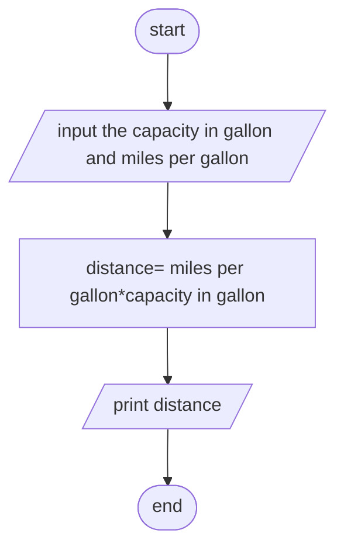

flowchart

```mermaid
    flowchart TD;
    A([start])-->B[/input the capacity in gallon and miles per gallon/];
    B-->C["distance= miles per gallon*capacity in gallon"];
    C-->D[/print distance/];
    D-->E([end]);
```