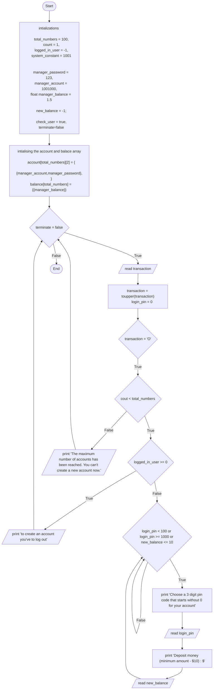

```mermaid
    flowchart TD;
    A([Start])-->B["
    intializations 

    total_numbers = 100,
    count = 1,
    logged_in_user = -1,
    system_constant = 1001


    manager_password = 123,
    manager_account = 1001000,
    float manager_balance = 1.5
    
    new_balance = -1;

    check_user = true,
    terminate=false
    
    "];


    B-->C["
    
    intialising the account and balace array

    account[total_numbers][2] = {
        {manager_account,manager_password},
    }
    balance[total_numbers] = {{manager_balance}}

    "];


    C-->D{terminate = false}

    D -->|True| E[/read transaction/]

    D -->|False| E1([End]);

    E -->F["
        transaction = toupper(transaction)
        login_pin = 0
    "]

    F --> G{transaction = 'O'}

    G --> |True| H{cout < total_numbers}

    H --> |True| I{logged_in_user >= 0}

    H --> |False| I1[/ print 'The maximum number of accounts has been reached. You can't create a new account now.' /]

    I1 --> D

    I --> |True| J[/print 'to create an account you've to log out'/]

    J --> D

    I --> |False| J1{login_pin < 100 or login_pin >= 1000 or new_balance <= 10}

    J1 --> |True| J2["print 'Choose a 3 digit pin code that starts without 0 for your account' "]

    J1 --> |False| J1

    J2 --> J3[/read login_pin/]

    J3 --> J4["print 'Deposit money (minimum amount - $10) : $' "]

    J4 --> J5[/read new_balance/]

    J5 --> J1


    
```