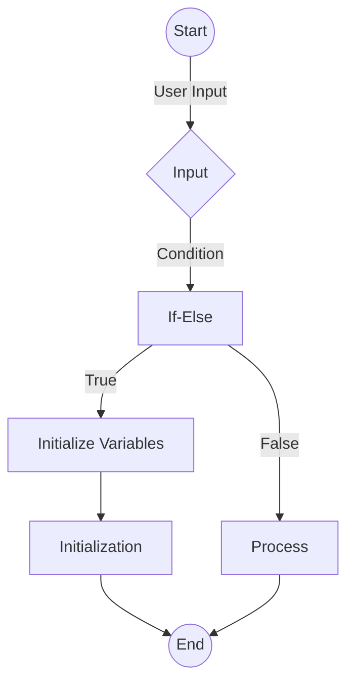

flowchart

```mermaid
    flowchart TD;
  A((Start)) -->|User Input| B{Input}
  B -->|Condition| C[If-Else]
  C -->|True| D[Initialize Variables]
  D --> E[Initialization]
  C -->|False| F[Process]
  E --> G((End))
  F --> G((End))

```