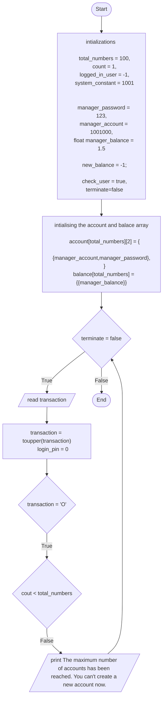

```mermaid
    flowchart TD;
    A([Start])-->B["
    intializations 

    total_numbers = 100,
    count = 1,
    logged_in_user = -1,
    system_constant = 1001


    manager_password = 123,
    manager_account = 1001000,
    float manager_balance = 1.5
    
    new_balance = -1;

    check_user = true,
    terminate=false
    
    "];


    B-->C["
    
    intialising the account and balace array

    account[total_numbers][2] = {
        {manager_account,manager_password},
    }
    balance[total_numbers] = {{manager_balance}}

    "];


    C-->D{terminate = false}
    D -->|True| E[/read transaction/]
    D -->|False| E1([End]);
    E -->F["
        transaction = toupper(transaction)
        login_pin = 0
    "]
    F --> G{transaction = 'O'}
    G --> |True| H{cout < total_numbers}
    H --> |False| I1[/ print The maximum number of accounts has been reached. You can't create a new account now. /]
    I1 --> D


    
```