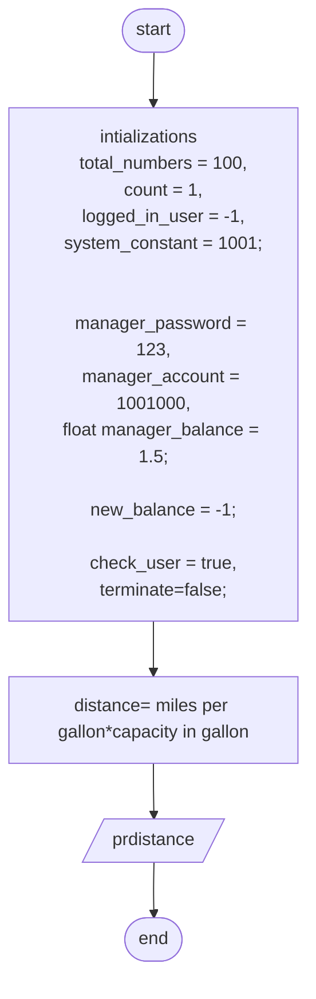
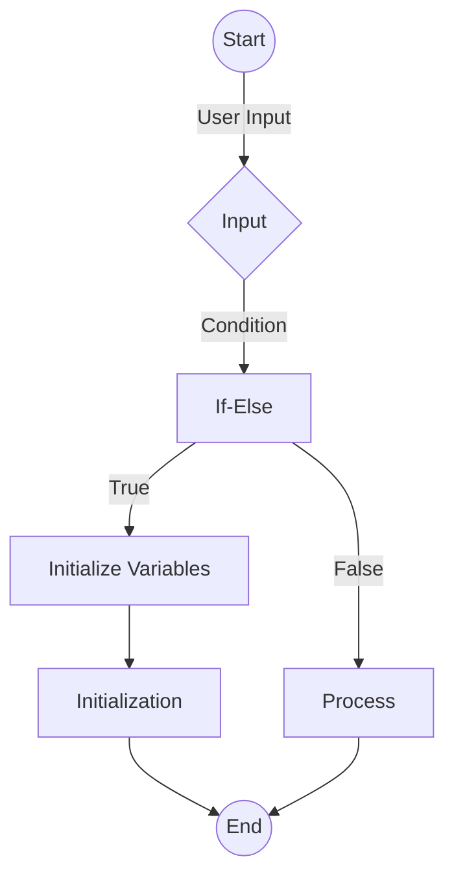

```mermaid
    flowchart TD;
    A([start])-->B["
    intializations  
    total_numbers = 100,
    count = 1,
    logged_in_user = -1,
    system_constant = 1001;


    manager_password = 123,
    manager_account = 1001000,
    float manager_balance = 1.5;
    
    new_balance = -1;

    check_user = true,
    terminate=false;
    
    "];
    B-->C["distance= miles per gallon*capacity in gallon"];
    C-->D[/prdistance/];
    D-->E([end]);
```

flowchart

```mermaid
    flowchart TD;
  A((Start)) -->|User Input| B{Input}
  B -->|Condition| C[If-Else]
  C -->|True| D[Initialize Variables]
  D --> E[Initialization]
  C -->|False| F[Process]
  E --> G((End))
  F --> G((End))

```